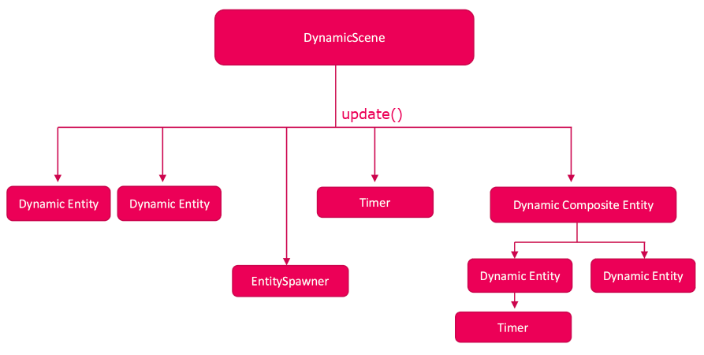

# Timing things

As can be read in [Scenes aka Levels](scenes.md), there are two different implementations of `YaegerScene` available:
a `StaticScene` and a `DynamicScene`. Their main difference resides in the fact that a `DynamicScene` contains a Game
World Update (GWA) to which all instances of `DynamicEntity` added to the scene will listen.

This chapter will discuss the different ways in the GWA can be used within Yaeger. It will start by discussing how the
GWA gets delegated to all Objects, after which different ways to use in within your Scene of Entity.

## How the GWA is delegated to all Objects

The GWA is initiated by the `DynamicScene`, and handed down to all Dynamic Entities that were added to the Scene. This
is done in the same order as in which they were added to the Scene.

## Using a `Timer` to create time-based events

On both Dynamic Scenes and Dynamic Entities one or more timers can be used to create time based events. To use such a
`Timer` the Scene or Entity should implement the interface `TimerContainer`. After doing so, the method `setupTimers()`
should be implemented and the method `addTimer(Timer)` can be called to add an instance of `Timer`.

## Exposing the GWA to Scenes and Entities

The GWA is kept internal on all Entities and Scenes and gets delegated downwards. It is, however, possible to expose the
GWA to an Entity or Scene by implementing the interface
`UpdateExposer`, which exposes an `explicitUpdate(long)` method. The value passed to this method represents a timestamp
of the current time and can be used to keep track of time.
